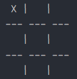
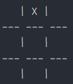
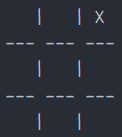
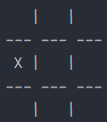
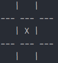
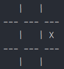
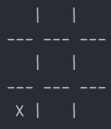
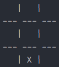
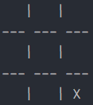

# Terminal based **Tic Tac Toe Game**

It is a simple implementation of Tic Tac Toe Game using Java for terminal based users. Supports two different users and
punishes user for invalid input 😢

## Installation

```bash
git clone https://github.com/ujjwalgarg100204/Tic-Tac-Toe-Game.git
```

## Dependency

[JDK](https://www.oracle.com/java/technologies/downloads/)

## Usage

```bash
# compile
javac src/DriverClass.java src/TicTacToe.java -d out/

# run
java -classpath out/ DriverClass
```

## Playing

Just enter player names and enter the cell coordinates when prompted.

### Correct way of entering coordinate

Coordinates can only put in the form of x,y without spaces.
> If you don't give input in the form specified, game won't give you second chance

##### Cell Mappings


<div style="display: flex;gap: 30px;flex-wrap: wrap">
    <div style="display: flex;justify-content: center;align-items: center;gap: 20px">
        <p>(1,1):</p>
        
    </div>
    <div style="display: flex;justify-content: center;align-items: center;gap: 20px">
        <p>(1,2):</p>
        
    </div>
    <div style="display: flex;justify-content: center;align-items: center;gap: 20px">
        <p>(1,3):</p>
        
    </div>
    <div style="display: flex;justify-content: center;align-items: center;gap: 20px">
        <p>(2,1):</p>
        
    </div>
    <div style="display: flex;justify-content: center;align-items: center;gap: 20px">
        <p>(2,2):</p>
        
    </div>
    <div style="display: flex;justify-content: center;align-items: center;gap: 20px">
        <p>(2,3):</p>
        
    </div>
    <div style="display: flex;justify-content: center;align-items: center;gap: 20px">
        <p>(3,1):</p>
        
    </div>
    <div style="display: flex;justify-content: center;align-items: center;gap: 20px">
        <p>(3,2):</p>
        
    </div>
    <div style="display: flex;justify-content: center;align-items: center;gap: 20px">
        <p>(3,3):</p>
        
    </div>
</div>

## Contributing

Pull requests are welcome. For major changes, please open an issue first to discuss what you would like to change.

Please make sure to update tests as appropriate.

## License

[MIT](LICENSE.txt)